

# Introduction to Quadcopter Modeling & Simulation

Pranav Lad, Dhruv Chandel 

 or 

**Curriculum Module**

_Created with R2025a. Compatible with R2025a and later releases._

# Information

This curriculum module contains interactive [MATLAB® live scripts](https://www.mathworks.com/products/matlab/live-editor.html) that teach the fundamental principles behind how a quadcopter operates.

   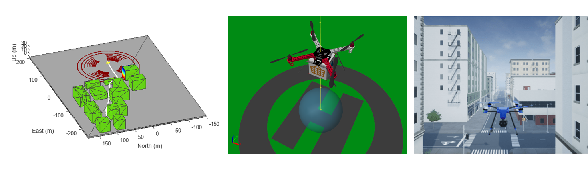

## Background

You can use these live scripts as demonstrations in lectures, class activities, or interactive assignments outside class. Starting from the basics of mathematical modeling, we will build up to a full simulation of a quadcopter delivering a package. We will also look at different fidelities of simulation ranging from simple cuboidal navigation models to detailed physical models to photorealistic simulations suitable for testing sensing and perception algorithms. Further resources are provided for student projects, competitions and researchers looking to develop their skills further for industrial applications or research.

The instructions inside the live scripts will guide you through the exercises and activities. Get started with each live script by running it one section at a time. To stop running the script or a section midway (for example, when an animation is in progress), use the  Stop button in the **RUN** section of the **Live Editor** tab in the MATLAB Toolstrip.

## Contact Us

Contact the [MathWorks Educator Content Development Team](mailto:onlineteaching@mathworks.com) if you would like to request assistance, provide feedback, or if you have a question.

## Prerequisites

It is expected that students going through this course should be familiar with the basics of MATLAB programming and working with the Simulink environment. They should also have a basic understanding of ordinary differential equations, physics, and numerical simulations. Additionally, a knowledge of basic Control Systems and Physical Modeling with Simscape will also be helpful. 

To help with the background requirements, Online Self\-Paced Courses are available on MATLAB Academy, which the students can use to learn more:

<u>**Fundamental introductions to the tools and environments**</u>

- [**MATLAB Onramp**](https://matlabacademy.mathworks.com/details/matlab-onramp/gettingstarted)
- [**Simulink Onramp**](https://matlabacademy.mathworks.com/details/simulink-onramp/simulink)
- [**Simscape Onramp**](https://matlabacademy.mathworks.com/details/simscape-onramp/simscape)

<u>**Targeted learning for specific workflows**</u>

[**Quick introductions**](https://matlabacademy.mathworks.com/?page=1&fq=onramp&sort=featured)

- [Control Design Onramp with Simulink](https://matlabacademy.mathworks.com/details/control-design-onramp-with-simulink/controls)
- [Circuit Simulation Onramp](https://matlabacademy.mathworks.com/details/circuit-simulation-onramp/circuits)
- [Power Electronics Simulation Onramp](https://matlabacademy.mathworks.com/details/power-electronics-simulation-onramp/powerelectronics)
- [Multibody Simulation Onramp](https://matlabacademy.mathworks.com/details/multibody-simulation-onramp/ormb)
- [Simscape Battery Onramp](https://matlabacademy.mathworks.com/details/simscape-battery-onramp/orsb)

[**Doing math with MATLAB**](https://matlabacademy.mathworks.com/?page=1&fq=mathematics-and-optimization&sort=featured)

- [Introduction to Linear Algebra](https://matlabacademy.mathworks.com/details/introduction-to-linear-algebra-with-matlab/linalg)
- [Introduction to Solving Ordinary Differential Equations](https://matlabacademy.mathworks.com/details/introduction-to-solving-ordinary-differential-equations/otmlsode)

[**Physical modeling**](https://matlabacademy.mathworks.com/?page=1&fq=physical-modeling&sort=featured)

- [Motor Modeling with Simscape Electrical](https://matlabacademy.mathworks.com/details/motor-modeling-with-simscape-electrical/otslmmse)
- [Battery State Estimation](https://matlabacademy.mathworks.com/details/battery-state-estimation/otslbse)

[**Control Systems**](https://matlabacademy.mathworks.com/?page=1&fq=control-systems&sort=featured)

- [Control System Modeling Essentials](https://matlabacademy.mathworks.com/details/control-system-modeling-essentials/otmlslcsme)
- [PID Control Techniques](https://matlabacademy.mathworks.com/details/pid-control-techniques/otmlslpct)

Each of these courses awards a certificate upon completion. The courses can also be assigned as homework alongside the course.

## Getting Started

### Accessing the Module

### **On MATLAB Online:**

Use the  link to download the module. You will be prompted to log in or create a MathWorks account. The project will be loaded, and you will see an app with several navigation options to get you started.

### **On Desktop:**

Download or clone this repository. Open MATLAB, navigate to the folder containing these scripts and double\-click on [UAV.prj](<matlab: openProject("UAV.prj")>). It will add the appropriate files to your MATLAB path, set up your starting directory, and open an app that asks you where you would like to start. 

Ensure you have all the required products ([listed below](#H_E850B4FF)) installed. If you need to include a product, add it using the Add\-On Explorer. To install an add\-on, go to the **Home** tab and select   **Add-Ons** > **Get Add-Ons**. 

## Products

[MATLAB®](http://www.mathworks.com/products/matlab.html), [Simulink®](https://www.mathworks.com/products/simulink.html),  [Stateflow®](https://www.mathworks.com/products/stateflow.html), [Aerospace Blockset](https://www.mathworks.com/products/aerospace-blockset.html), and [Simulink® Real\-Time™](https://www.mathworks.com/products/simulink-real-time.html) are used throughout. The [RigidTransforms](#M_5db9) script also uses the [Image Processing Toolbox™](https://www.mathworks.com/products/image-processing.html), and the [Computer Vision Toolbox™](https://www.mathworks.com/products/computer-vision.html). The [Trajectory Generation](#M_3cef) script also uses the [Robotics System Toolbox™](https://www.mathworks.com/products/robotics.html). The [QuadcopterBasics](#M_531f) script and [PropellerModel](#M_72c8) script also use the [Symbolic Math Toolbox™](https://www.mathworks.com/products/symbolic.html). The [QuadcopterMovement](#M_8e4a) script uses the [UAV Toolbox™](https://www.mathworks.com/products/uav.html).

# Learning Materials

## Mathematical Background

###  **1.** [**Projectile Motion**](https://matlab.mathworks.com/open/github/v1?repo=MathWorks-Teaching-Resources/Quadcopter-Modeling-Simulation&project=UAV.prj&file=Scripts/ProjectileMotion.mlx)

Introduction to numerical modeling & simulation of differential equations.

||||
| :-- | :-- | :-- |
| 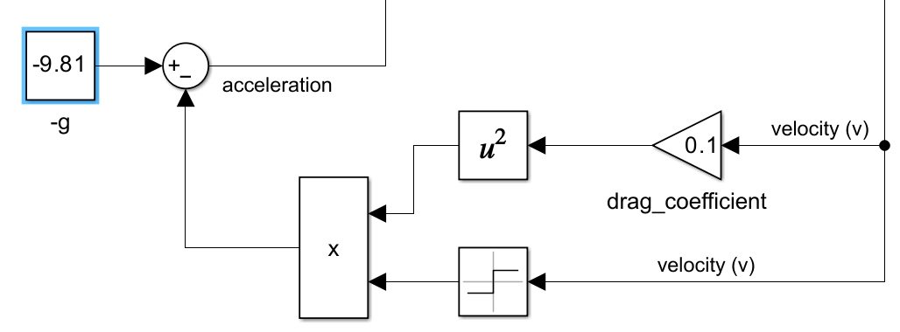    | **In this script, students will...**   $\bullet$ Practice creating numerical simulation models in MATLAB and Simulink.     | **Models referenced**   $\bullet$ [Projectile\_1D.slx](./Models/Projectile_1D.slx)   $\bullet$ [Projectile\_1D\_WithDrag.slx](./Models/Projectile_1D_WithDrag.slx)     |

###  **2.** [**Rigid Transforms**](https://matlab.mathworks.com/open/github/v1?repo=MathWorks-Teaching-Resources/Quadcopter-Modeling-Simulation&project=UAV.prj&file=Scripts/RigidTransforms.mlx)

Introduction to mathematical modeling with six degrees of freedom.

||||
| :-- | :-- | :-- |
| 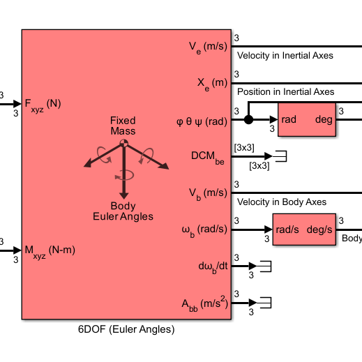    | **In this script, students will...**   $\bullet$ Learn about movement in 6 degrees\-of\-freedom.    | **Models referenced**   $\bullet$ Modeling a Six Degree of Freedom Motion Platform     |

## **Modeling a Quadcopter**

###  **3.** [**Propeller Model**](https://matlab.mathworks.com/open/github/v1?repo=MathWorks-Teaching-Resources/Quadcopter-Modeling-Simulation&project=UAV.prj&file=Scripts/PropellerModel.mlx)

Create a simple propeller model using blade element theory and dimensional analysis.

||||
| :-- | :-- | :-- |
| 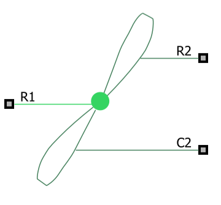    | **In this script, students will...**   $\bullet$ Construct a minimal physical model of a quadcopter propeller.   $\bullet$ Understand how rotor speed produces thrust and torque.   $\bullet$ Understand how thrust and torque depend on the width of a rotor.    | **Models referenced**   $\bullet$ [SimplePropellerModel.slx](./Models/SimplePropellerModel.slx)     |

###  **4.** [**Quadcopter Basics**](https://matlab.mathworks.com/open/github/v1?repo=MathWorks-Teaching-Resources/Quadcopter-Modeling-Simulation&project=UAV.prj&file=Scripts/QuadcopterBasics.mlx)

Describe the basic components of a quadcopter and explore a simple physical model.

||||
| :-- | :-- | :-- |
| 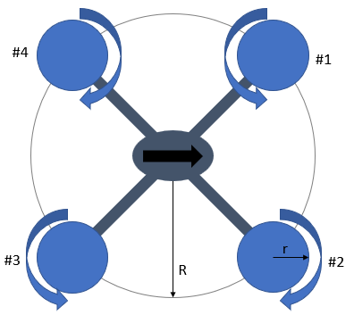    | **In this script, students will...**   $\bullet$ Learn the fundamental components of a physical quadcopter   $\bullet$ Learn how to balance forces to model a quadcopter hovering    |   |

###  **5.** [**Quadcopter Movement**](https://matlab.mathworks.com/open/github/v1?repo=MathWorks-Teaching-Resources/Quadcopter-Modeling-Simulation&project=UAV.prj&file=Scripts/QuadcopterMovement.mlx)

Explore the implications of moving in a 3D world.

||||
| :-- | :-- | :-- |
| 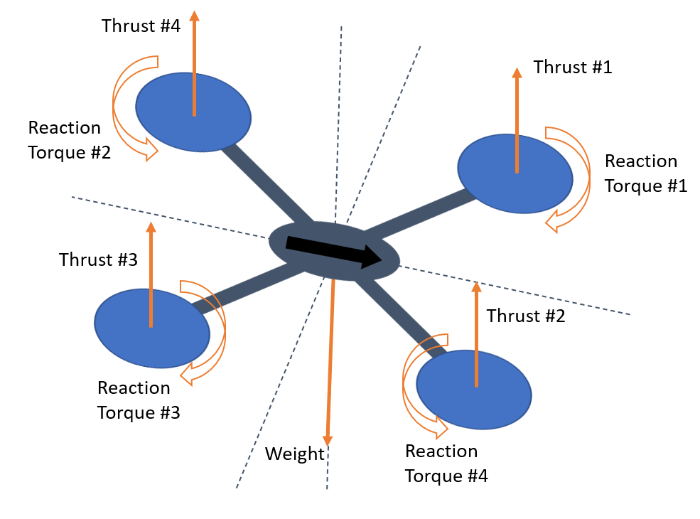    | **In this script, students will...**   $\bullet$ Learn the fundamentals of quadcopter movement: elevation, pitch, roll, and yaw    | **Models referenced**   $\bullet$ [UAV\_Sim.slx](./Models/UAV_Sim.slx)     |

###  **6.** [**Quadcopter Control**](https://matlab.mathworks.com/open/github/v1?repo=MathWorks-Teaching-Resources/Quadcopter-Modeling-Simulation&project=UAV.prj&file=Scripts/QuadcopterControl.mlx)

Investigate using PID control systems on a quadcopter.

||||
| :-- | :-- | :-- |
| 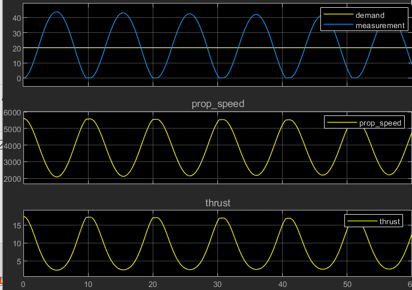    | **In this script, students will...**   $\bullet$ Learn how to implement hover control in a Simulink model.    $\bullet$ Learn how to implement directional controls in a Simulink model.   $\bullet$ Practice tuning a PID controller.    | **Models referenced**   $\bullet$ [QuadcopterPID_Vertical.slx](./Models/QuadcopterPID_Vertical.slx)   $\bullet$ [UAV\_Hover\_Sim.slx](./Models/UAV_Hover_Sim.slx)   $\bullet$ [XY\_Control.slx](./Models/XY_Control.slx)     |

## **Improving Fidelity**

###  **7.** [**Multidomain Physical Modeling**](https://matlab.mathworks.com/open/github/v1?repo=MathWorks-Teaching-Resources/Quadcopter-Modeling-Simulation&project=UAV.prj&file=Scripts/MultidomainPhysicalModeling.mlx)

Improve the fidelity of a quadcopter model with Simscape elements.

||||
| :-- | :-- | :-- |
| 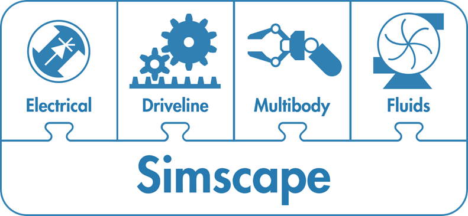    | **In this script, students will...**   $\bullet$ Use pulse width modulation on a DC motor   $\bullet$ Model a propeller in Simscape    | **Models referenced**   $\bullet$ Build and Simulate a Simple DC Motor   $\bullet$ [Propeller_Model.slx](./Models/Propeller_Model.slx)   $\bullet$ [Propeller\_Ref\_Speed.slx](./Models/Propeller_Ref_Speed.slx)     |

###  **8.** [**Trajectory Generation**](https://matlab.mathworks.com/open/github/v1?repo=MathWorks-Teaching-Resources/Quadcopter-Modeling-Simulation&project=UAV.prj&file=Scripts/ExampleCollectionOnTrajectories.mlx)

Explore two documentation examples on trajectory generation

||||
| :-- | :-- | :-- |
| 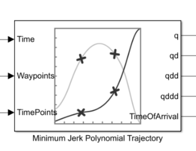    | **In this script, students will...**   $\bullet$ Explore the effects of planning trajectories to minimize jerk   $\bullet$ Learn about Simscape Results Explorer, spatial contact forces and applications of multibody modeling    | **Models referenced**   $\bullet$ Generate Minimum Jerk Trajectory   $\bullet$ Package Delivery Quadcopter Example     |

###  **9.** [**Quadcopter Package Delivery**](https://matlab.mathworks.com/open/github/v1?repo=MathWorks-Teaching-Resources/Quadcopter-Modeling-Simulation&project=UAV.prj&file=Scripts/QuadcopterFromFEX.mlx)
||||
| :-- | :-- | :-- |
| 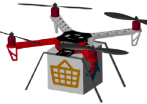    | **In this script, students will...**   $\bullet$ Explore the fully implemented model to see the various subsystems \- electrical, mechanical and maneuver controller.   $\bullet$ Work on exercises on motor sizing, testing stability and range, integrating a 3D propeller, and more.    | **Models referenced**   $\bullet$ Quadcopter Drone Model in Simscape     |

###  **10.** [**Sensor Fusion**](https://matlab.mathworks.com/open/github/v1?repo=MathWorks-Teaching-Resources/Quadcopter-Modeling-Simulation&project=UAV.prj&file=Scripts/SensorFusion.mlx)

Explore two documentation examples on trajectory generation

||||
| :-- | :-- | :-- |
| 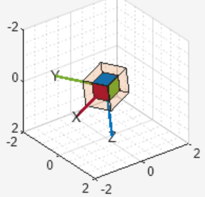    | **In this script, students will...**   $\bullet$ Learn about combining measurements from different sensors to estimate the location   $\bullet$ Design a Kalman Filter to estimate the angular position of a pendulum   $\bullet$ Design an Extended Kalman Filter to estimate the angular position of the nonlinear pendulum system    | **Models referenced**   $\bullet$ IMU and GPS Fusion for Inertial Navigation   $\bullet$ virtualPendulumModel.slx (Kalman Filter Lab)     |

###  **11.** [**Scenario Generation**](https://matlab.mathworks.com/open/github/v1?repo=MathWorks-Teaching-Resources/Quadcopter-Modeling-Simulation&project=UAV.prj&file=Scripts/ScenarioGeneration.mlx)

Explore a variety of high\- and low\-fidelity scenarios.

||||
| :-- | :-- | :-- |
| 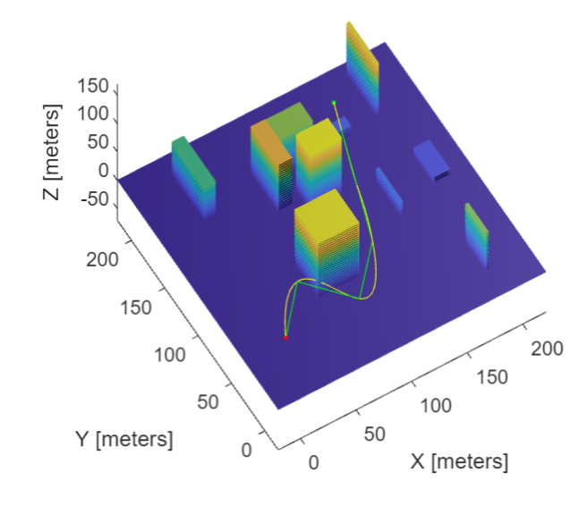    | **In this script, students will...**   $\bullet$ Explore building low\-fidelity scenarios to test trajectories   $\bullet$ Explore the capabilities of Unreal Engine for building high\-fidelity, photo\-realistic scenarios   $\bullet$ Consider how much fidelity is necessary to answer different modeling questions    | **Models referenced**   $\bullet$ UAV Scenario Tutorial   $\bullet$ Plan Minimum Snap Trajectory for Quadrotor   $\bullet$ Simulate Simple Flight Scenario and Sensor in Unreal Engine Environment   $\bullet$ UAV Package Delivery System     |

## [**Next Steps**](https://matlab.mathworks.com/open/github/v1?repo=MathWorks-Teaching-Resources/Quadcopter-Modeling-Simulation&project=UAV.prj&file=Scripts/NextSteps.mlx)

Suggest additional directions that students may be interested in exploring including Advanced Control, Working with ROS and Gazebo, and the Challenge Projects.

# License

The license for this module is available in the [LICENSE.md](https://github.com/MathWorks-Teaching-Resources/Quadcopter-Modeling-Simulation/blob/release/LICENSE.md).

# Related Courseware Modules

## [Engineering Problem Solving](https://www.mathworks.com/matlabcentral/fileexchange/180430-engineering-problem-solving)
|||
| :-- | :-- |
| 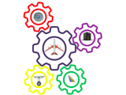    | **Available on:**          [GitHub](https://github.com/MathWorks-Teaching-Resources/Engineering-Problem-Solving)     |

## [Introduction to Robotics](https://www.mathworks.com/matlabcentral/fileexchange/181503-introduction-to-robotics-university-of-cape-town) \- University of Cape Town
|||
| :-- | :-- |
| 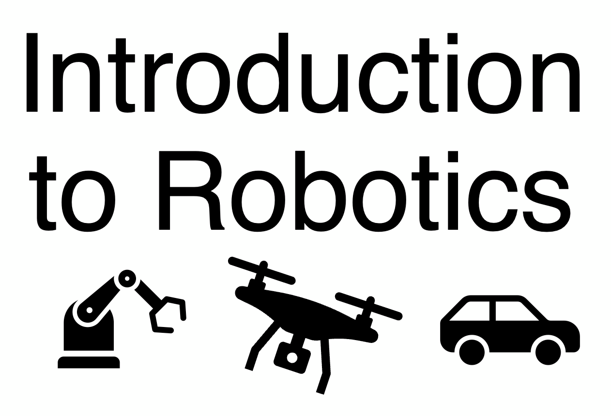    | **Available on:**          [GitHub](https://github.com/ArnoldPretoriusUCT/Introduction-to-Robotics)     |

Or feel free to explore our other [modular courseware content](https://www.mathworks.com/matlabcentral/fileexchange/?q=author%3A%22MathWorks+Educator+Content+Development+Team%22&sort=relevancy).

# Educator Resources
- [Educator Page](https://www.mathworks.com/academia/educators.html)

# Contribute 

Looking for more? Find an issue? Have a suggestion? Please contact the [MathWorks Educator Content Development team](mailto:%20onlineteaching@mathworks.com). If you want to contribute directly to this project, you can find information about how to do so in the [CONTRIBUTING.md](https://github.com/MathWorks-Teaching-Resources/Quadcopter-Modeling-Simulation/blob/release/CONTRIBUTING.md) page on GitHub.

 *©* Copyright 2026 The MathWorks, Inc
